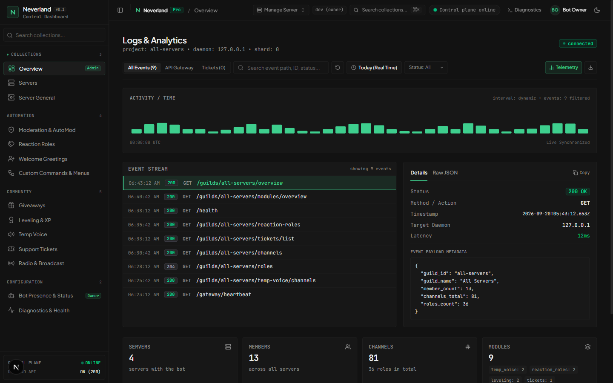

# Neverland

Enterprise Discord Automation Platform and Next.js 15 Web Dashboard

[](https://ko-fi.com/E1E41CVWBU)
[](https://github.com/bitt-ar/Neverland-bot/stargazers)
[](https://github.com/bitt-ar/Neverland-bot/network/members)
[](https://github.com/bitt-ar/Neverland-bot/issues)
[](LICENSE)
[](https://www.python.org/)
[](https://github.com/Rapptz/discord.py)
[](https://nextjs.org/)

Neverland is an all-in-one Discord automation platform designed for performance, modularity, and administration. It combines an asynchronous Python Discord bot core with a Next.js 15 web dashboard styled using Supabase design principles and an integrated cross-platform CLI.



---

## Quickstart

Install, configure, and initialize Neverland in a single command. The installer provisions the Python virtual environment, installs dependencies, registers the `neverland` CLI executable in your PATH, launches the configuration wizard, and starts the services.

### Windows (PowerShell)
```powershell
irm https://raw.githubusercontent.com/bitt-ar/Neverland-bot/main/scripts/install.ps1 | iex
```

### Linux and macOS (Bash)
Supports Debian, Ubuntu, Fedora, CentOS, RHEL, Rocky Linux, AlmaLinux, Arch Linux, Manjaro, openSUSE, Alpine Linux, Void Linux, and macOS.
```bash
curl -fsSL https://raw.githubusercontent.com/bitt-ar/Neverland-bot/main/scripts/install.sh | bash
```

---

## CLI Reference

The platform provides a unified CLI (`neverland`) to manage configuration, runtime states, process lifecycle, and reverse proxies.

```text
  _   _                     _                 _ 
 | \ | | _____   _____ _ __| | __ _ _ __   __| |
 |  \| |/ _ \ \ / / _ \ '__| |/ _` | '_ \ / _` |
 | |\  |  __/\ V /  __/ |  | | (_| | | | | (_| |
 |_| \_|\___| \_/ \___|_|  |_|\__,_|_| |_|\__,_|
 All-in-One Discord Automation & Web Dashboard Platform
 Created by bitt-ar
```

### Commands

| Command | Description |
|---|---|
| `neverland config` | Run the interactive configuration wizard for Development or Production modes. |
| `neverland start` | Launch the Discord Bot and Web Dashboard. |
| `neverland start -d` | Launch the Bot and Dashboard in daemon (background) mode. |
| `neverland stop` | Gracefully terminate all active Neverland processes and child trees. |
| `neverland restart` | Restart all running services. |
| `neverland status` | Inspect real-time status of the Bot, Dashboard, database connectivity, and ports. |
| `neverland logs` | Tail and monitor service logs (`--follow`, `--bot`, `--dashboard`). |
| `neverland domain` | Generate reverse proxy configurations (Nginx, Caddy) and Systemd unit files. |
| `neverland uninstall` | Completely remove virtual environments, dependencies, build caches, and configuration profiles. |

### Environment Isolation

Neverland enforces strict profile separation between development and production setups:

- **Development (`dev`)**: Configured for local guild testing (`GUILD_ID`), binds to `localhost:3000`, bypasses public Discord OAuth2. Saved in `.neverland/profiles/dev.env`.
- **Production (`prod`)**: Configured for public domains, full Discord OAuth2 authentication, hardened session cookies, and reverse proxy compatibility. Saved in `.neverland/profiles/prod.env`.

Switching modes activates the selected profile without overwriting or leaking variables from the other environment.

---

## Architecture

```
+------------------------------------+           Internal HTTP IPC           +------------------------------------+
|           Web Dashboard            | ------------------------------------> |         Bot Control Plane          |
|       Next.js 15 + Tailwind        |       (Secret-Gated Header Auth)      |       Python aiohttp Daemon        |
|      Turbopack, Supabase Style     | <------------------------------------ |         Port 8800 (Local)          |
+------------------------------------+             JSON Payloads             +------------------------------------+
                  |                                                                     |
                  |                   +-------------------------+                       |
                  +-----------------> |    MongoDB Database     | <---------------------+
                                      | Guild Configs & States  |
                                      +-------------------------+
                                                   ^
                                                   | Gateway WebSocket & REST
                                      +-------------------------+
                                      |    Discord Platform     |
                                      +-------------------------+
```

---

## Modules Directory

| Module | Identifier | Route | Permissions |
|---|---|---|---|
| Support Tickets | `tickets` | `/community/tickets` | `manage_channels`, `manage_roles` |
| Moderation and Audit | `moderation` | `/automation/moderation` | `moderate_members`, `kick_members`, `ban_members` |
| Giveaways Engine | `giveaways` | `/community/giveaways` | `manage_guild`, `manage_messages`, `embed_links` |
| Temporary Voice Lounges | `temp_voice` | `/community/temp-voice` | `manage_channels`, `move_members` |
| Leveling and XP | `leveling` | `/community/leveling` | `manage_roles`, `send_messages`, `embed_links` |
| Reaction Roles | `reaction_roles` | `/automation/reaction-roles` | `manage_roles`, `send_messages`, `add_reactions` |
| Welcome and Onboarding | `welcome` | `/automation/welcome` | `send_messages`, `embed_links`, `manage_roles` |

### Module Overview

- **Support Tickets**: Race-safe ticket creation with atomic counters in MongoDB, private channel isolation, persistent components surviving restarts, and transcript export.
- **Moderation**: Warn, mute/timeout, kick, and ban actions with case tracking, direct message notices, and audit logging.
- **Giveaways**: Interactive giveaway creator supporting image embeds, countdown timers, entry multipliers, role gates, and context menu reroll shortcuts.
- **Temporary Voice**: Dynamic voice lounge generation on join, automatic ownership delegation, permission locks, member limits, and channel cleanup upon exit.
- **Leveling**: Message and voice XP calculation, rate limiting, customizable level-up announcements, rank cards rendered dynamically with Pillow, and tiered role rewards.
- **Reaction Roles**: Multi-mode role assignment via classic reactions, persistent Discord buttons, and dropdown selection menus synchronized in real time.
- **Control Plane IPC**: Internal authenticated HTTP bridge linking Next.js 15 route handlers directly to the Discord bot daemon.

---

## Server and Domain Deployment

### 1. Configure Production Environment
```bash
neverland config --mode prod
```

### 2. Generate Reverse Proxy Configuration
```bash
# Generate Nginx configuration
neverland domain nginx

# Or generate Caddy configuration
neverland domain caddy
```

#### Example Nginx Configuration (`/etc/nginx/sites-available/neverland`):
```nginx
server {
    listen 80;
    server_name dashboard.yourdomain.com;

    location / {
        proxy_pass http://127.0.0.1:3000;
        proxy_http_version 1.1;
        proxy_set_header Upgrade $http_upgrade;
        proxy_set_header Connection 'upgrade';
        proxy_set_header Host $host;
        proxy_cache_bypass $http_upgrade;
        proxy_set_header X-Forwarded-For $proxy_add_x_forwarded_for;
        proxy_set_header X-Forwarded-Proto $scheme;
    }
}
```

Enable SSL via Certbot:
```bash
sudo certbot --nginx -d dashboard.yourdomain.com
```

### 3. Discord Developer Portal Configuration
In the Discord Developer Application settings:
1. Navigate to **OAuth2 > General**.
2. Add the Redirect URI:
   ```text
   https://dashboard.yourdomain.com/api/auth/callback/discord
   ```
3. Save changes.

### 4. Systemd Service Setup
Generate systemd unit files:
```bash
neverland domain systemd
```
Enable and start the units:
```bash
sudo systemctl enable --now neverland-bot
sudo systemctl enable --now neverland-dashboard
```

---

## Sponsorship

Neverland is maintained by [bitt-ar](https://github.com/bitt-ar). Support ongoing development via [Ko-fi](https://ko-fi.com/E1E41CVWBU).

---

## License

Neverland is licensed under the [MIT License](LICENSE).
Copyright (c) 2026 bitt-ar.
